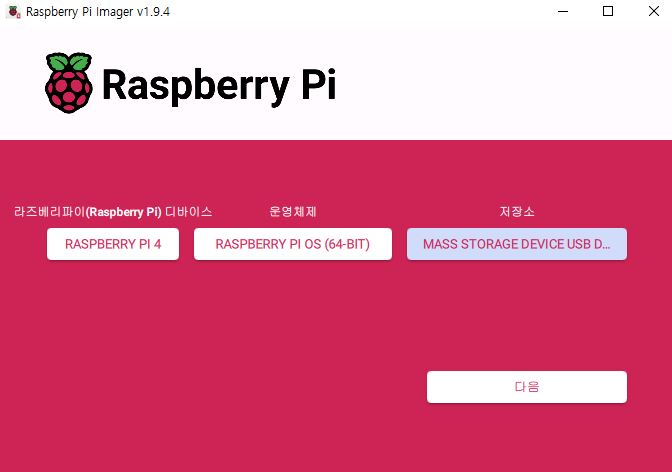

# 라즈베리 파이 설정

책에서 라즈베리 파이를 가지고 커널을 수정하며 학습한다. 고로 라즈베리 파이에 대해 간략히 알아보고  
셋업 과정을 정리해 두고자 한다.

## 라즈베리 파이란?

Raspberry Pi는 전 세계적으로 널리 쓰이는 리눅스 개발용 보드이자 소형 컴퓨터이다. 설치 과정이 간단하고,  
가성비도 좋아 다양한 디바이스 드라이버를 구현하는 데 사용할 수 있다. 또한 교육용으로 많이 쓰이고 실전 개  
발에서 다양한 데모용 디바이스로 자주 활용 된다.

## 라즈베리 파이 설치

책에서 PI3(1GB RAM)으로 했지만 본인은 PI4(2GB RAM)을 사용한다. 살짝 차이가 있겠지만 학습이라 치겠다.

라즈베리 파이를 설치하려면 먼저 이미지 파일을 받아야한다. 아래의 링크로 가서 받으면 된다.  
[라즈베리 파이 이미지 다운](https://www.raspberrypi.com/software/)  


라즈베리파이는 부팅 디바이스로 마이크로 SD카드를 사용한다. 포맷후 이미지를 쓰면 된다. 근데 포맷을 FAT32로  
해야하는 데 내 컴퓨터에서 보려니 없다. SD 포맷터라는 별도의 프로그램으로 해주는 수 밖에 없다.  
[SD포맷터 다운](https://www.sdcard.org/downloads/formatter/)


라즈베리 파이 4, 64bit로 특별한 설정없이 바로 설치했다. 현재 컴퓨터로는 30분 정도 걸렸다.
  


## VNC 원격 제어

설치 후 언어나 네트워크 같은 환경 설정만 하면 된다. 그런데 추가로 모니터와 키보드, 마우스를 설치하려니 정신 사납다.  
더욱히 문서작성을 위해 스크린샷을 찍어야하는 데 이러면 원격으로 할 수 밖에 없다. 파이에서 VNC 설정을 켜고 내 PC에서  
 VNC뷰어로 연동을 해야한다. 파이의 ip주소와 처음에 설정한 ID/PW를 입력하면 된다.

  


## 라즈베리 파이 커널 빌드

라즈비안 리눅스 커널 소스코드를 받기전에 리눅스 유틸리티 프로그램을 설치하자

```bash
apt-get install git bc bison flex libssl-dev
```

install 뒤에 오는 것은 git, bc(계산기), bison(파서 생성기, 컴파일러나 인터프리터 만들 때 사용), flex(lexer 생성기, bision과 함께 소스 코드 분석 도구 만들때 사용), libssl-dev(OpenSSL라이브러리의 개발용 헤더 파일과 라이브러리)라는 패키지 들이다.

다음 명령어로 최신 라즈비안 커널 소스코드를 받을 수 있다.

```bash
git clone --depth=1 https://github.com/raspberrypi/linux
```

clone할때 브랜치를 명시 안하면 최신 브랜치 소스코드를 받는다. 현재는 벌써 6.12까지 나왔다. 이 책은 4.19버전을 사용하므로  
 rpi-4.19.y 브랜치를 선택해야한다.

```bash
git clone --depth=1 --branch rpi-4.19.y https://github.com/raspberrypi/linux
```

이제 빌드를 하기 위한 설정을 진행할 수 있다. 그런데 나는 PI버전이 달라서 명령어를 다르게 줘야한다.  
아래의 공식문서를 참조하자.  
[빌드 설정](https://www.raspberrypi.com/documentation/computers/linux_kernel.html)

```bash
cd linux
KERNEL=kernel8
make bcm2711_defconfig
```

이제 커널을 빌드해야하는 데 이것도 명령어가 32/64비트 따라 다르다. 나는 64bit이다. 멀티코어인 파이에서 make j  
 명령어가 코어사이의 일감을 분개하게 한다. 이를 통해 컴파일 속도를 늘릴 수 있다.

```bashGO
make -j6 Image.gz modules dtbs
```

거의 1시간 반이 걸렸다. 빌드 할떄마다 이런 명령어를 계속 입력하기 귀찮다. 이들을 모아서 하나의 파일로 만들 수 있다.  
이를 '빌드 셸 스크립트'라 한다.

```bash
#!/bin/bash

echo "configure build output path"

//현 작업 디렉터리를 KERNEL_TOP_PATH 변수로 저장
KERNEL_TOP_PATH="$( cd "$(dirname "$0")" ; pwd -P)"
//KERNEL_TOP_PATH에 out폴더를 만들고 OUTPUT 변수로 저장
OUTPUT="$KERNEL_TOP_PATH/out"
echo "$OUTPUT"

KERNEL=kernel8
//rpi_build_log.txt를 빌드로그에 저장,
BUILD_LOG="$KERNEL_TOP_PATH/rpi_build_log.txt"

echo "move kernel source"
cd linux

echo "make defconfig"

make O=$OUTPUT bcm2711_defconfig

echo "kernel build"
//2>&1 | tee $BUILD_LOG는 커널을 빌드 할떄 출력되는 메시지를 $BUILD_LOG에 저장 한다는 뜻
make O=$OUTPUT -j4 Image.gz modules dtbs 2>&1 | tee $BUILD_LOG

```

O=$OUTPUT를 통해 빌드시 만들어지는 오브젝트와 커널 이미지 파일이 out폴더에 생성된다.

이어서 빌드한 걸 라즈베리 파이에 설치하는 스크립트를 작성해보자.

```bash
#!/bin/bash

KERNEL=kernel8
KERNEL_TOP_PATH="$( cd "$(dirname "$0")" ; pwd -P)"
OUTPUT="$KERNEL_TOP_PATH/out"
echo "$OUTPUT"

cd linux

//커널 모듈을 부트 미디어에 설치
make O=$OUTPUT -j6 modules_install
cp $OUTPUT/arch/arm64/boot/Image.gz /boot/firmware/$KERNEL.img
cp $OUTPUT/arch/arm64/boot/dts/broadcom/*.dtb /boot/firmware/
cp $OUTPUT/arch/arm64/boot/dts/overlays/*.dtb* /boot/firmware/overlays/

```

설치자체는 5분도 안걸렸다. 설치 후 재부팅을 해주면 된다. ~~공식문서대로 /boot/firmware/\*로 중간에 firmware 폴더를 넣었는데
부팅 자체가 안되었다.결국 저자 블로그에 있는 대로 이를 뺴고 이 모든 과정을 다시 하니 잘 된다.~~
uname -a로 커널 버전을 확인하자. 내가 imager로 구운 버전하고 내가 수정한 버전이랑 차이가 심하게 나는 게 원인인 것같다.

  


## 리눅스 커널의 소스의 구조

- arch : arch의 하부 디렉터리에는 아키텍처별로 동작하는 커널 코드가 있다.

  - arm : 32비트 계열 ARM 아키텍쳐 코드가 있으며, 라즈비안도 이 하부 디렉터리 코드를 실행한다.
  - arm64 : 64비트 계열 ARM 아키텍쳐 코드가 있다.
  - x86 : 인텔 x86 아키텍쳐 코드가 있다.

- include : 커널 코드 빌드에 필요한 헤더 파일이 있다.

- Documentation : 커널 기술 문서가 있는 폴더로 커널 시스템에 대한 기본 동작을 설명하는 문서를 찾을 수 있다.

- kernel : 커널의 핵심 코드가 있는 디렉터리로, 다음과 같은 하위 디렉터리를 확인할 수 있다. 아키텍처와 무관한 커널 공통코드가 있다.

  - irq : 인터럽트 관련 코드
  - sched : 스케줄링 코드
  - power : 커널 파워 매니지먼트 코드
  - locking : 커널 동기화 관련 코드
  - printk : 커널 콘솔 관련 코드
  - trace : ftrace 관련 코드

- mm : Memory Management의 약자로 가상 메모리 및 페이징 관련 코드가 있다.

- drivers: 모든 시스템의 디바이스 드라이버 코드가 있다. 하부 디렉터리에 드라이버 종류별 소스가 들어있다.

- fs : 모든 파일 시스템 코드가 담긴 폴더이다. fs 폴더에 있는 파일에는 파일 시스템 공통 함수가 들어 있고 파일 시스템별로 하나씩
  세분화된 폴더를 볼 수 있다.

- lib : 커널에서 제공하는 라이브러리 코드가 있다.

#### 참조

- [SD 카드 포맷관련\_1](https://forums.raspberrypi.com/viewtopic.php?t=263810#:~:text=I%20know%20the%20boot%20partition%20needs%20to,trying%20to%20accomplish%20doable?%20If%20so%2C%20how?)
- [SD 카드 포맷관련\_2](https://m.blog.naver.com/elepartsblog/221900762982)
- [파이4 커널빌드](https://austindhkim.tistory.com/507)
- [VNC 화면 미출력 문제](https://m.blog.naver.com/elepartsblog/221828692886)
- [VNC 키 입력 안되는 문제](https://superuser.com/questions/682287/vnc-console-does-not-accept-any-keyboard-mouse-inputs)
- [4.19버전 관련](https://remnant24c1.tistory.com/477)
