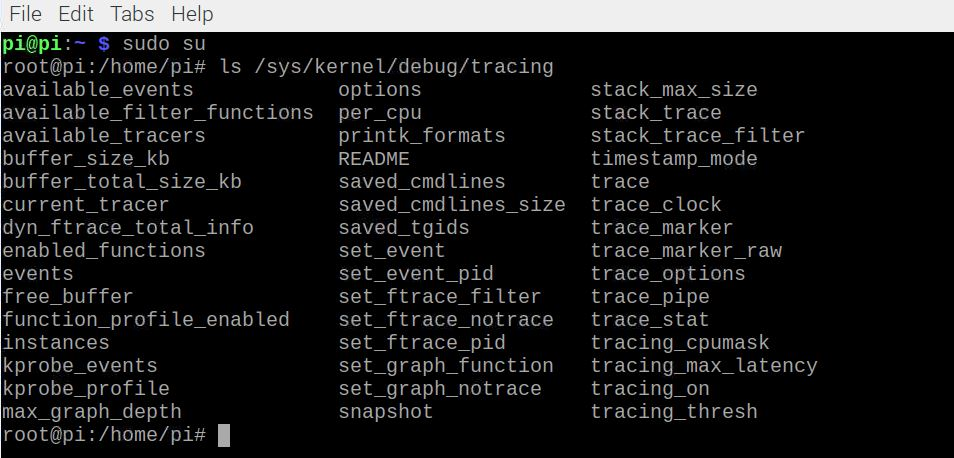
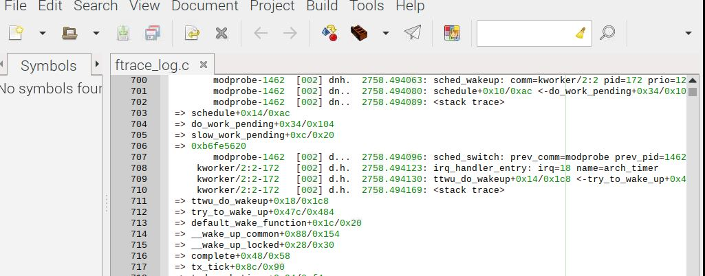

# 커널 디버깅

저자가 커널소스를 변경하는 예를 들면서 디버깅을 통한 학습을 강조하는 절은 생략했다. 커널 디버깅 툴을  
활용하는 방법위주로 정리 했다. 3장 5절에 TRACE32 내용이 중요하다면서 명령어 4~5개만 훝고 말아서 생략했다.

## 디버깅이란

디버깅은 'debug'와 '-ing'의 합성어로 버그를 잡는 과정을 뜻한다. 실전에서 문제 발생시 확보한 커널 로그와 메모리 덤프로  
문제의 원인을 분석할 수 있다. 이를 커널 디버깅이라하며 커벌 디버깅은 정확한 문제 원인 분석으로 이어지고, 이를 통해 문제를  
해결 하게 된다. 즉, 커널 디버깅은 문제 해결 능력과 직관된다.

## printk() 함수

C언어에서 printf()로 콘솔 문자열을 출력하듯 'printk()'함수를 이용하면 커널 로그를 볼 수 있다. 이미 많은 커널 내부 함수들도  
printk()로 시스템 에러 정보를 커널로그로 출력 한다. C언어의 printf()처럼 서식 지정 또한 가능하다.

- int(%d 또는 %x)
- unsigned int(%u 또는 %x)
- long(%ld 또는 %lx)
- unsigned long(%lu 또는 %lx)
- long long(%lld 또는 %llx)
- unsigned long long(%llu 또는 %llx)
- size_t(%zu 또는 %zx)
- ssize_t(%zd 또는 %zx)
- s32(%d 또는 %x)
- u32(%u 또는 %x)
- s64(%lld 또는 %llx)
- u64(%llu 또는 %llx)

printk()로 포인터를 출력하려면 %p를 쓰면 된다. 커널은 심벌 테이블을 갖고 있고 %pS를 쓰면 함수 주소를 심벌로 출력한다. 이는  
함수 포인터를 디버깅할 때 자주 쓰는 기법이다. 한번 실습해 보자.

kernel/workqueue.c에 아래의 코드를 추가했다.

```c
//현 프로세스의 태스크 디스크립터 주소 출력
printk("[+] process: %s \n", current->comm);
printk("[+][debug] message [F: %s, L:%d]: caller:(%pS)\n",
        __func__,__LINE__,(void*)__buildtin_return_address(0));
```

아래 것들은 GCC컴파일러에서 제공하는 매크로이다.  
**FUNC**:현재 실행 중인 함수 이름  
**LINE**:현재 실행 중인 코드 라인  
\_\_buildtin_return_address(0):현재 실행 중인 함수를 호출한 함수의 주소

dmesg라는 메시지로 커널출력 메세지를 확인할 수 있다.  
  


다만 주의 사항이 있는 데 커널에서 1초에 수 백번 이상 호출되는 함수에 사용하면 시스템이 락업(LockUp: 리눅스 디바이스에서 마우스나 키보드 따위를 입력해도 반응이 없는 상황)되거나 커널 패닉으로 오동작 할 수 있다. printk는 비용이 많이 드는 함수다. 파일시스템의 도움으로 로그를 콘솔 버퍼에 저장하는 세부 동작을 수행한다. 이떄 세부 동작을 컨솔 드라이버에서 처리하고 커널 로그를 저장하는 동작을 백그라운드에서 처리하기 떄문이다.

자주 호출되는 함수라도 콜 스택을 보고 싶을 떄가 있는 데 이때 사용할 수 있는 게 ftrace다(곧 있으면 볼 것이다).

## dump_stack() 함수

printk 외에도 커널 로그를 통해 커널 동작을 보여주는 기능을 제공한다. dum_stack()을 호출하면 콜 스택을 커널 로그로 볼 수 있다.
dump_stack() 함수의 사용법은 간단하다. 콜 스택을 보고 싶은 코드에 dum_stack()만 추가해주면 된다.

함수 호출을 위해 "linux/kernel.h"를 include 해야 한다. 함수 선언부를 보면 인자와 반환 값 모두 타입이 void이다.

```c
asmlinkage __visible void dump_stack(void);
```

kernel/fork.c에다가 추가 한다. \_do_fork()함수에 테스트를 할 건데, 이 함수는 프로세스 생성시에만 호출되서 빈도수 걱정은 없다.
먼저 debug_kernel_thread라는 전역변수를 추가하고 add_latent_entropy()다음에 호출하자.

```c
static int debug_kernel_thread=1;
//_do_fork()
if(debug_kernel_thread)
{
        printk("[+][%s] process n", current->comm);
        dump_stack();
}
```

_테스트.JPG>)

PID가 920인 bash 프로세스가 CPU1에서 실행주이라는 뜻 이다.

밑에 연달아 나오는 건 콜 스택이다. \_do_fork() 위로 보이는 것들은 dump_stack()에서 콜 스택을 출력할 때마다 보이는 것으로 무시해도  
되는 정보다.

주의사항으로 이 함수는 printk()보다도 많은 일을 한다. 실행 시 내부에서 현재 실행중 인 프로세스 스택 주소를 읽어서 스택에 푸시된 프레임  
포인터 레지스터를 읽는다. ARM 아키텍처의 함수 호출 규약에 따라 프레임 포인터 레지스터를 읽어서 함수 호출 내역을 추적하는 동작을 반복한다.

## ftrace() 함수

이번에는 리눅스 커널에서 제공하는 강력한 디버그 기능인 ftrace()를 알아 보자. 책에서는 ftrace()를 통해 콜 스택과 커널 내부를 분석한다.  
실무에서도 이것을 자주 이용한다고 한다.

printk와 dump_stack에 불편함을 느낀 개발자들이 다음을 충족하는 디버깅 기능을 원했다.

- 소스 코드 수정없이도 함수 호출 흐름을 보고 싶다.
- 커널 세부 실행 정보를 출력해 줬으면 좋겠다.
- 1초에 수십번 호출해도 성능에 부담이 없었으면 좋겠다.
- 커널 로그도 함꼐 보고 싶다.

이 모든 걸 충족시키는 게 ftrace()함수다. 특징은 다음과 같다.

1. 인터럽트, 스케줄링, 커널 타이머 등의 커널 동작을 상세 추적한다.
2. 함수 필터를 지정하면 지정한 함수를 호출한 함수와 전체 콜 스택까지 출력한다. 코드 수정은 필요 없다.
3. 함수를 어느 프로세스가 실행 하는 지 알 수 있다.
4. 함수 실행 시간 정보를 알 수 있다.
5. 시스템 부하가 적다.

ftrace에서 제공하는 nop, function, fuction_graph 트레잇를 사용하려면 ftrace관련 코드가 커널이미지에 포함되어 있어야 한다.  
이를 위해 커널 설정 컨피그를 활성화 해야 한다. /arch/arm/configs/파이에 맞는 defconfig파일에 다음의 옵션을 추가하면된다.  
라즈비안에서는 기본으로 설정되어 있어서 따로 해 줄 필요는 없다.

- CONFIG_FTRACE =y
- CONFIG_DYNAMIC_FTRACE =y
- CONFIG_FUNCTION_TRACER =y
- CONFIG_FUNCTION_GRAPH_TRACER =y
- CONFIG_IRQSOFF_TRACER =y
- CONFIG_SCHED_TRACER =y
- CONFIG_FUNCTION_PROFILER =y
- CONFIG_TRAEER_SNAPSHOT =y

그러면 ftrace 설정 파일은 어디서 확인 할까? /sys/kernel/debug/traing에서 ftrace 드라이버 설정 폴더와 파일을 볼 수 있다.



### ftrace 설정

이제 ftrace를 설정 해보자. 다음과 같은 셸 스크립트로 빨리 설정 하자.

```bash
#!/bin/bash

echo 0 > /sys/kernel/debug/tracing/tracing_on
sleep 1
echo "tracing off"
#ftrace 이벤트 전체 비활성화
echo 0 > /sys/kernel/debug/tracing/events/enable
sleep 1
echo "events disabled"

echo secondary_start_kernel > /sys/kernel/debug/tracing/set_ftrace_filter
sleep 1
echo "set_ftrace_filter_init"

echo function > /sys/kernel/debug/tracing/current_tracer
sleep 1
echo "function tracer enabled"

echo 1 > /sys/kernel/debug/tracing/events/sched/sched_wakeup/enable
echo 1 > /sys/kernel/debug/tracing/events/sched/sched_switch/enable

echo 1 > /sys/kernel/debug/tracing/events/irq/irq_handler_entry/enable
echo 1 > /sys/kernel/debug/tracing/events/irq/irq_handler_exit/enable

echo 1 > /sys/kernel/debug/tracing/events/raw_syscalls/enable
sleep 1
echo "event enabled"

echo schedule ttwu_do_wakeup > /sys/kernel/debug/tracing/set_ftrace_filter
sleep 1
echo "set_ftrace_filter_enabled"

echo 1 > /sys/kernel/debug/tracing/options/func_stack_trace
echo 1 > /sys/kernel/debug/tracing/options/sym-offset
echo "function stack trace enabled"

echo 1 > /sys/kernel/debug/tracing/tracing_on
echo "tracing on"
```

굳이 sleep 1을 하는 이유는 커널이 ftrace 설정 명령을 충분히 실행 할 시간을 확보하기 위함이다.
echo 0이면 비활성화 1이면 활성화이다.

ftrace는 다양한 트레이서를 제공 하는 데 핵심 내용을 다음과 같다.

- nop : 기본트레이서. ftrace 이벤트만 출력한다.
- function : 함수 트레이서. set_ftrace_filter로 지정한 함수를 누가 호출하는 지 출력한다.
- function_graph: 함수 실행 시간과 세부 호출 정보를 그래프 포맷으로 출력한다.

트레이서를 성정하려면 다음과 같이 current_tracer 파일에 트레이서 이름을 저장 해야한다. 라즈비안에서  
nop이 기본으로 설정 되어 있다.

```bash
echo funcion > /sys/kernel/debug/tracing/current_tracer
```

set_ftrace_file에 트레이싱할 함수를 지정한다. 단 available_filter_functions 파일에 포함된 함수만 지정 가능하며  
아니라면 시스템이 락업 된다. 만약 지정을 안하면 커널 내부에 모든 함수를 트레이싱하므로 락업 상태로 빠진다.

/sys/kernel/debug/tracing/options/func_stack_trace를 켜면 콜 스택을 볼 수 있다. 즉, set_ftrace_filter에  
지정된 함수의 콜스택을 볼 수 있다.

echo 1 > /sys/kernel/debug/tracing/options/sym-offset를 켜면 함수 호출 시 주소의 오프셋을 출력한다.

### 로그 추출

다음의 셸 스크립트를 작성하자

```bash
#!/bin/bash

echo 0 > /sys/kernel/debug/tracing/tracing_on
echo "ftrace off"
sleep 3

cp /sys/kernel/debug/tracing/trace .
mv trace ftrace_log.c
```



### 로그 분석

chromium-browse - 1436 [002] d.. 9445.131875 : sched_switch : prev_comm=chromium-browse prev_pid=1436  
prev_prio=128 prev_state=S ==> next_comm=kworker/2:3 next_pid=1454 next_prio=120

우선 공통적 포맷은 다음과 같다.

- 프로세스 이름 : chromium-browse
- PID : 1436
- CPU 번호 : [002]
- 타임 스탬프 : 9445.131875
- 컨텍스트 정보 : d..
- 이벤트 : sched_switch

컨텍스트 세부정보를 표현하는 알파벳의 의미는 다음과 같다.

- d: 해당 CPU라인의 인터럽트를 비활성화한 상태
- n: 현재 프로세스가 선점 스케줄링 될 수 있는 상태
- h/s: h이면 인터럽트 컨텍스트, s이면 Soft IRQ 컨텍스트
- 0~3: 프로세스 thread_info 구조체의 preemt_count 값
