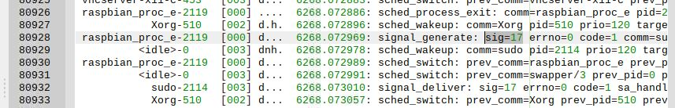
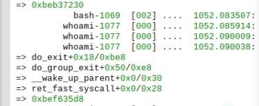

# 프로세스

프로세스 관련 자료구조와 ftrace 로그 분석을 통해 프로세스를 실습으로 공부하자.

## 프로세스란?

간다히 말해 리눅스 시스템 메모리에서 '실행 중인 프로그램'을 말한다. 다수의 프로세스를 실시간으로 사용하는 기법을  
'멀티 프로세싱'이라고 하며, 같은 시간에 여러 프로그램을 실행하는 방식을 '멀티 태스킹'이라고 한다.

프로세스를 관리하는 자료구조이자 객체를 '태스크 디스크립터'(task descriptor)라고 부르고, task_struct 구조체로 표현된다.
이 구조체에 프로세스가 사용하는 메모리 리소스, 프로세스 이름, 실행 시각, PID, 프로세스 스택 최상단 주소 같은 속성 정보가  
저장 된다.

프로세스의 '실행 흐름'은 어느 구조체에 저장 될 까? 프로세스 '스택'으로, 이 스택 최상단 주소에 'thread_info'구조체가 있다.
프로세스는 함수를 실행할 때 프로세스 스택의 메모리 공간을 사용한다. 모든 프로세스들은 커널 공간에서 실행될 때 각자 스택 공간  
을 할당받아 스택 내에서 함수를 실행한다.

그렇다면 이전 함수로 돌아가는 건 어떤 정보를 보고 참조해서 할까? 프로세스가 마지막에 실행했던 레지스터 세트와 실행 흐름은 스  
택공간에 저장되어 있다.

정리하자면 리눅스 커널에서 프로세스를 표현하는 자료구조는 다음과 같다.

- tastk_struct : 태스크 디스크립터
- thread_info : 프로세스 스레드 정보

### 태스크란?

사실 태스크는 다른 OS에서 예전부터 써온 용어다. 태스크는 OS에서 이름그대로 실행(Execution)을 말한다. 예전에는 특정 코드나  
프로그램 실행을 일괄 처리했다. 이러한 실행 및 작업 단위를 태스크라 했다. 임베디드 개발자는 태스크의 개수와 이름을 정했고 시스템을 구동하는 동안에 태스크는 바뀌지 않았다. 시간이 흘러 임베디드 개발자들이 리눅스를 사용하는 프로젝트로 유입되었고, 태스크라는 용어를 사용했다. '프로그램을 실행하는 단위'라는 태스크의 개념이 프로세스와 겹치는 부분이 많았다고 한다. 그래서 예전에 썼던 태스크라는 용어를  
 리눅스 커널에도 그대로 쓰고 있다. 그래서 커널의 함수 이름이나 변수중에 task라는 단어가 보이면 process관련 코드라 봐도 좋다.

### 스레드란?

스레드는 유저 레벨에서 생선된 가벼운 프로세스라 보아되 된다. 이란 프로세스에 비해 컨텍스트 스위칭을 할 때 시간이 적게 들며 자신이 속한  
프로세스 내의 다른 스레드와 파일 디스크립터, 파일 및 시그널 정보에 대한 주소공간을 공유한다.

허나 커널 입장에서는 스레드를 다른 프로세스와 동등하게 관리한다. 대신 각 프로세스 시결자인 태스크 디스크립터에서 스레드 그룹 여부를  
점검한다.

## 프로세스 확인

파이에서 "ps -ely"라는 명령어(실행 중인 프로세스 출력)를 실행하자.


저자에 따르면 init_task라는 전역 변수를 통해 전체 프로세스 목록을 출력한다고 한다. 모든 프로세스는 이 변수의 tasks필드에 연결 리스트  
방식으로 등록 되어 있다고 한다.

이번에는 "-ejH"라는 옵션을 사용해보자.


부모 자식 프로세스 관계를 토대로 출력이 되어있다. kthreadadd는 커널 프로세스를 생성을 담당한다. 고로 이 자식들은 모두 커널 스레드, 프로세스다.

커널이 프로세스를 생성하면 프로세스에 고유 ID값을 부여하는 데 이를 PID(Process IDentifier)라고 한다.

```c
//linux/types.h

typedef __kernel_pid_t pid_t;

//uapi/asm-generic/posix_types.h
typedef int __kernel_pid_t;
```

pid_t는 int형이다. 그리고 부여방식은 간단한데 증가시키는 방식이다. 따라서 pid를 보고 어느것이 먼저 생성 되었는 지 알수 있다.

리눅스에서 공통으로 커널이 생성하는 프로세스가 있는 데 각각 다음과 같은 PID를 부여한다.

- swapper : 0
- init : 1 (보통 pid가 1인 프로세스를 init 프로세스라 하며 모든 유저 공간에서 생성된 프로세스의 부모역할을 한다.)
- kthreadadd : 2

pid를 유저 공간에서 확인하려면 getpid()를 호출하면 된다. 이를 호출하면 시스템 콜 핸들러인 sys_getpid()가 호출된다.

```c
//kernel/sys.c

SYSCALL_DEFINE0(getpid)
{
    return task_tgid_vnr(current);
}
```

이 함수를 보면 task_tgid_vnr()에 현재 실행 중인 프로세스의 태스크 디스크립터 주소를 담은 current를 인자로 하여 pid를 읽는다.

각 프로세스는 부모/자식 프로세스가 있다. 자식은 종료시 부모에 신호를 알린다. 예외적으로 부모가 먼저 종료되면 조부모가 부모 역할을 한다.  
대부분 init 프로세스가 조부모 역할을 한다.

## 프로세스 생성

리눅스엣 구동되는 프로세스는 크게 유저레벨에서 생성한 된 것과 커널레벨에서 생성 된 것으로 분류된다. 각 타입별로 생성과정이 다르다.

- 유저 프로세스 : 유저공간에서 프로세스를 생성하는 라이브러리(GNU C : glibc)의 도움을 받아 커널에게 생성 요청
- 커널 프로세스 : 커널 내부의 kthread_create()함수 호출

이 둘의 공통점으로 생성 시에 \_do_fork()함수를 호출 한다.

### \_do_fork()

리눅스에서 구동 중인 프로세스는 \_do_fork() 실행할 떄 생성 된다. 유저레벨 프로세스는 init 프로세스, 커널레벨 프로세스는 kthreadadd프로세스가 당담한다. 그런데 프로세스는 생성이라기 보다는 복제에 가깝다. 프로세스 생성시에 필요한 리소스를 각각 할당하면 시간이 오래 걸리므로 이미 생성된 프로세스에게서 리소스를 물려 받는 것이다. 프로세스 생성시 부모 프로세스의 데이터를 복제하는 것이 더 효율적이기 때문이다.

```c
//linux/kernel/fork.c
long _do_fork(unsigned long clone_flags,
	      unsigned long stack_start,
	      unsigned long stack_size,
	      int __user *parent_tidptr,
	      int __user *child_tidptr,
	      unsigned long tls)
```

생성 성공시 타입은 long이지만 pid를 반환하고 실패시 PTR_ERR() 매크로로 지정된 에러 값을 반환한다.

clone_flags는 부모에게서 복제될 리소스 정보를 의미하며 OR 연산한 결과가 저장된다.

```c
//linux/include/uapi/linux/sched.h

/*
 * cloning flags:
 */
#define CSIGNAL		0x000000ff	/* signal mask to be sent at exit */
#define CLONE_VM	0x00000100	/* set if VM shared between processes */
#define CLONE_FS	0x00000200	/* set if fs info shared between processes */
#define CLONE_FILES	0x00000400	/* set if open files shared between processes */
#define CLONE_SIGHAND	0x00000800	/* set if signal handlers and blocked signals shared */
#define CLONE_PTRACE	0x00002000	/* set if we want to let tracing continue on the child too */
#define CLONE_VFORK	0x00004000	/* set if the parent wants the child to wake it up on mm_release */
#define CLONE_PARENT	0x00008000	/* set if we want to have the same parent as the cloner */
#define CLONE_THREAD	0x00010000	/* Same thread group? */
#define CLONE_NEWNS	0x00020000	/* New mount namespace group */
#define CLONE_SYSVSEM	0x00040000	/* share system V SEM_UNDO semantics */
#define CLONE_SETTLS	0x00080000	/* create a new TLS for the child */
#define CLONE_PARENT_SETTID	0x00100000	/* set the TID in the parent */
#define CLONE_CHILD_CLEARTID	0x00200000	/* clear the TID in the child */
#define CLONE_DETACHED		0x00400000	/* Unused, ignored */
#define CLONE_UNTRACED		0x00800000	/* set if the tracing process can't force CLONE_PTRACE on this clone */
#define CLONE_CHILD_SETTID	0x01000000	/* set the TID in the child */
#define CLONE_NEWCGROUP		0x02000000	/* New cgroup namespace */
#define CLONE_NEWUTS		0x04000000	/* New utsname namespace */
#define CLONE_NEWIPC		0x08000000	/* New ipc namespace */
#define CLONE_NEWUSER		0x10000000	/* New user namespace */
#define CLONE_NEWPID		0x20000000	/* New pid namespace */
#define CLONE_NEWNET		0x40000000	/* New network namespace */
#define CLONE_IO		0x80000000	/* Clone io context */

/*
```

'stack_start'는 보통 유저 영역에서 스레드 생성할 때 복사하려는 스택의 주소이다. 이 스택 주소는 유저 공간에서 실행 중인  
프로세스 스택의 주소이다.  
'stack_size' 유저 영역에서 실행 중인 스택 크기. 보통 유저영역에서 스레드를 생성할 때 복사한다.  
'parent_tidptr', 'child_tidptr'는 각각 부모와 자식스레드 그룹을 관리하는 핸들러 정보이다.

그렇다면 커널에서 \_do_fork()를 언제 호출할 까? 프로세스 유형에 따라 흐름이 다르다.

1. 유저모드에서 생성한 프로세스 : sys_clone() 시스템 콜 핸들러 함수
2. 커널모드에서 생성한 커널 스레드 : kernel_thread() 함수

~~이어지는 유저/커널 모드외 시스템콜 설명은 생략했다. 너무 기본이니까~~

유저 레벨프로세스 생성시 전체 과정을 보자.

1. (유저 공간) fork()
2. (커널 공간) sys_clone(), fork에 대응하는 시스템 콜 핸들러
3. (커널 공간) \_do_fork()

sys*clone()함수 코드를 살펴보자. sys_clone이라는 이름이 없는 데, 이는 커널에서 제공하는 SYSCALL_DEFINE 매크로와  
함께 함수 이름을 지정하면 커널 소스를 빌드하는 과정에서 지정한 이름 앞에 'sys*'접두사를 붙여 심벌을 생성한다.  
어쩄든 함수 내부에서 \_do_fork를 호출하는 걸 확인 할 수 있다.

```c
//linux/kernel/fork.c
#ifdef __ARCH_WANT_SYS_VFORK
SYSCALL_DEFINE0(vfork)
{
	return _do_fork(CLONE_VFORK | CLONE_VM | SIGCHLD, 0,
			0, NULL, NULL, 0);
}
#endif


```

비슷한 일을 하는 sys_fork()와 sys_vfork()도 안에서 \_do_fork()를 호출한다. 둘다 레거시코드이다.

```c
#ifdef __ARCH_WANT_SYS_FORK
SYSCALL_DEFINE0(fork)
{
#ifdef CONFIG_MMU
	return _do_fork(SIGCHLD, 0, 0, NULL, NULL, 0);
#else
	/* can not support in nommu mode */
	return -EINVAL;
#endif
}

#ifdef __ARCH_WANT_SYS_VFORK
SYSCALL_DEFINE0(vfork)
{
	return _do_fork(CLONE_VFORK | CLONE_VM | SIGCHLD, 0,
			0, NULL, NULL, 0);
}
#endif
```

이어서 커널 프로세스의 생성과정을 보자. 크게 2단계로 나뉜다.

1. kthread_create()를 호출하여 kthreadd 프로세스에게 커널 프로세스 생성 요청
2. 꺠어난 kthreadd 프로세스는 요청이 있는 지 점검하고 있다면 생성한다.

아래는 커널 스레드 생성 예시이다.

```c
//linux/drivers/vhost/vhost.c
/* Caller should have device mutex */
long vhost_dev_set_owner(struct vhost_dev *dev)
{
	struct task_struct *worker;
	int err;

	/* Is there an owner already? */
	if (vhost_dev_has_owner(dev)) {
		err = -EBUSY;
		goto err_mm;
	}

	/* No owner, become one */
	dev->mm = get_task_mm(current);
	worker = kthread_create(vhost_worker, dev, "vhost-%d", current->pid);
    //...
}
```

커널 스레드는 대부분 부팅과정에서 생성되며 이후 배경작업으로 주기적으로 실행된다. 물론 필요시 동적으로 생성될 때도 있다.

## 유저 레벨프로세스 실습

ps로 프로세스 목록을 출력해보자.

  
bash라는 이름의 프로세스를 출력한 결과 2개가 나왔다. 터미널을 하나 더 띄우고 다시해보자.  
  
목록에 하나 더 추가 된게 보인다. 새로운 프로그램이 실행하면 이에 대응되는 프로세스가 생성되는 걸 확인 했다.
프로그램을 실행하면 메모리에 적재되어 동작하는 것이 프로세스다.

바탕화면에 터미널 셸 아이콘이 있다 치자. 이를 더블클릭하면 바탕화면을 처리하는 프로세스가 이벤트를 받아 bash 프로세스를 생성한다.  
이처럼 대부분의 유저 프로세스는 셸이나 다른 프로세스를 통해 실행되고 스스로 실행하지 못한다.

이번엔 프로세스를 생성해보자 소스코드는 다음과 같다. 문자열 출력후 3초 대기를 500번 반복하는 코드다.

```c
//rapbian_test.c
#include <stdio.h>
#include <unistd.h>

#define PROC_TIMES 500
#define SLEEP_DURATION 3

int main()
{
    int porc_times = 0;

    for(proc_times = 0; proc_times<PROC_TIMES;proc_times++)
    {
        printf("rasbian tracing \n");
        sleep(SLEEP_DURATION);
    }

    return 0;
}
```

컴파일을 쉽게 하기 위해 다음과 같이 코드를 작성하고 파일명을 Makefile로 저장하자.

```c
raspbian_proc: raspbian_test.c
    gcc -o raspbian_proc raspbian_test.c
```

make명령어로 Makefile을 실행하면 raspbian_proc이라는 실행파일이 만들어진다.

ftrace 로그 설정을 해야하는데 지난번에 만들어놓은 파일에서 콜스택을 볼 함수와 추적할 이벤트만 바뀐다.

```bash
echo sys_clone do_exit > /sys/kernel/debug/tracing/set_ftrace_filter
echo \_do_fork copy_proess\* >> /sys/kernel/debug/tracing/set_ftrace_filter
#...
echo 1 > /sys/kernel/debug/tracing/events/sched/sched_fork/enable
echo 1 > /sys/kernel/debug/tracing/events/sched/sched_exit/enable
```

로그 설정후 실행 해보자.

  


raspbian_proc의 부모 프로세스 아이디(PPID)가 1221로 sudo를 가르키고 있다.


kill 명령어로 pid를 넘기면 해당 프로세스를 종료할 수 있다. 이제 ftrace로그를 추출하자(get_ftrace.sh).

1. 프로세스 생성 :


bash-1263이 보이는 데 로그 출력하는 주체가 pid가 1263인 bash라는 뜻이다. 그리고 bash-1263이 위의 콜스택으로 호출중 임을  
나타낸다.

  
pid가 1272인 프로세스를 생성하는 걸 알 수 있다. 자식이름도 bash인데 자식 프로세스 생성 과정 초기에 이름도 복제가 되지만 끝에서  
자식이름으로 바꾼다. 이 동작을 확인하려면 ftrace에서 task_rename이라는 동작을 추적해야한다.

2. raspbian_proc 실행 :


주기적으로 실행되었다가 다시 휴면상태로 바뀌었다가를 반복하는 걸 알 수 있다.

3. 프로세스 종료 :

kill 명령어를 입력하면 종료 시그널을 받아 소멸된다.


직전에 9번 시그널이 생성된 게 보이는 데 이것은 SIGKILL이다.

```c
//linux/include/uapi/asm-generic/signal.h
#define SIGHUP		 1
#define SIGINT		 2
#define SIGQUIT		 3
#define SIGILL		 4
#define SIGTRAP		 5
#define SIGABRT		 6
#define SIGIOT		 6
#define SIGBUS		 7
#define SIGFPE		 8
#define SIGKILL		 9
#define SIGUSR1		10
#define SIGSEGV		11
#define SIGUSR2		12
#define SIGPIPE		13
#define SIGALRM		14
#define SIGTERM		15
#define SIGSTKFLT	16
#define SIGCHLD		17
#define SIGCONT		18
#define SIGSTOP		19
#define SIGTSTP		20
#define SIGTTIN		21
#define SIGTTOU		22
#define SIGURG		23
#define SIGXCPU		24
#define SIGXFSZ		25
#define SIGVTALRM	26
#define SIGPROF		27
#define SIGWINCH	28
#define SIGIO		29
#define SIGPOLL		SIGIO
/*
#define SIGLOST		29
*/
#define SIGPWR		30
#define SIGSYS		31
#define	SIGUNUSED	31

/* These should not be considered constants from userland.  */
#define SIGRTMIN	32
#ifndef SIGRTMAX
#define SIGRTMAX	_NSIG
#endif

```

아래는 rapbian*proc의 종료 흐름이다.  


4. 부모 프로세스에 시그널 전달 :

프로세스 종료시에 부모 프로세스에 SIGHLD(17) 시그널을 전달한다. ~~중간에 한번 종료하고 정신이 없었는데 제대로 로그 출력이 안됬나보다~~.

### exit 함수로 프로세스 종료

유저프로세스가 종료 시그널을 받아 소멸될 수도 있지만 프로세스가 POSIX exit 시스템 콜을 호출해서 스스로 종료할 수도 있다.  
raspbian_proc에 'exit(EXIT_SUCCESS);' 를 넣고 다시 해보자. 아까 했던대로 Makefile를 수정하여 실행파일을 만들고 ftrace도 다시켜자.

  


이전절에서는 시그널을 받아서 do_exit()가 호출 됐지만 이번에는 유저 공간에서 exit()를 호출하여 커널 공간에서 해당 시스템콜 핸들러인 sys_exit_group()함수가 호출된다.

  
부모프로세스인 sudo에 SIGHLD를 보내는 걸 알 수 있다.

## 커널 스레드

커널 프로세스는 커널 공간에서만 실행되는 프로세스로 대부분 커널 스레드 형태로 동작한다. 커널 스레드는 다음 세가지 특징이 있다.

- 커널 공간에서만 실행되며 유저 공간과 상호작용하지 않는다.
- 실행, 휴면 등 모든 동작을 커널에서 직접제어 관리
- 대부분 부팅할 때 생성되고 시스템 종료시까지 백그라운드로 실행된다.

데몬과 다른 점은 유저영역과 시스템콜 없이 동작한다.

### 커널 스레드 종류

'ps -axjf'로 커널 스레드 목록을 확인할 수 있다.


- kthreadd : 모든 커널 스레드의 부모 프로세스, 스레드 핸들러 함수는 kthreadd()이며 커널 스레드를 생성한다.
- 워커스레드 : 워크큐에 있는 워크를 실행하는 프로세스, 스레드 핸들러 함수는 worker_Thread()함수이며 process_one_work()함수를
  호출해서 실행 한다.
- irq/86-mmc1 : IRQ스레드라고하며 인터러트 후반부 처리를 위해 쓰이는 프로세스, 보통 'irq/번호-이름'으로 구성

커널 스레드 핸들러라는 개념이 나오는데, 커널 스레드는 일반 프로세스와 달리 세부동작을 커널함수로 구현해야한다. 또한 커널 스레드 생성시 인자로 커널 스레드 핸들러 함수를 지정해야한다. 이 세부 동작이 핸들러 함수에 구현돼 있다.

### 커널 스레드 생성

크게 2단계로 나뉜다.

1. kthreadd 프로세스에 커널 스레드 생성 요청 :

유저 프로세스 생성시 fork()를 호출한 것처럼 kthread_creat() 커널함수를 호출 해야한다.

```c
//linux/include/linux/kthread.h

struct task_struct *kthread_create_on_node(int (*threadfn)(void *data),
					   void *data,
					   int node,
					   const char namefmt[], ...);

/**
 * kthread_create - create a kthread on the current node
 * @threadfn: the function to run in the thread
 * @data: data pointer for @threadfn()
 * @namefmt: printf-style format string for the thread name
 * @arg...: arguments for @namefmt.
 *
 * This macro will create a kthread on the current node, leaving it in
 * the stopped state.  This is just a helper for kthread_create_on_node();
 * see the documentation there for more details.
 */
#define kthread_create(threadfn, data, namefmt, arg...) \
	kthread_create_on_node(threadfn, data, NUMA_NO_NODE, namefmt, ##arg)

```

- int (\* threadfn)(void\_ data) : 스레드 핸들러 함수 주소 저장
- void\* data : 핸들러 함수로 전달하는 매개변수
- int node : 노드 정보
- const char namefmt[] : 스레드 이름

kthread_create()는 매크로라서 컴파일하면 kthread_create_on_node()로 바뀐다. 이어서 살펴보자.

```c
//linux/kernel/kthread.c
struct task_struct *kthread_create_on_node(int (*threadfn)(void *data),
					   void *data, int node,
					   const char namefmt[],
					   ...)
{
	struct task_struct *task;
	va_list args;

	va_start(args, namefmt);
	task = __kthread_create_on_node(threadfn, data, node, namefmt, args);
	va_end(args);

	return task;
}

struct task_struct *__kthread_create_on_node(int (*threadfn)(void *data),
						    void *data, int node,
						    const char namefmt[],
						    va_list args)
{
	DECLARE_COMPLETION_ONSTACK(done);
	struct task_struct *task;
    //동적 메모리 할당
	struct kthread_create_info *create = kmalloc(sizeof(*create),
						     GFP_KERNEL);

	if (!create)
		return ERR_PTR(-ENOMEM);
    //전달 받은 매개변수를 kthread_info 구조체에 저장
	create->threadfn = threadfn;
	create->data = data;
	create->node = node;
	create->done = &done;

	spin_lock(&kthread_create_lock);
	list_add_tail(&create->list, &kthread_create_list);
	spin_unlock(&kthread_create_lock);

	wake_up_process(kthreadd_task);
    //...
}
```

딱히 하는 건 없고 \_\_kthread_create_on_node()를 호출한다. 결국 \_\_kthread_create_on_node()에서 스레드 생성이  
이루어 진다. 연결리스트에 노드 추가 함수를 호출하는데 이는 kthreadd 프로세스가 연결리스트를 통해서 생성 요청을 확인하기  
때문이다. 후에 kthreadd_task를 인자로 하여 kthreadd를 꺠운다.

```c
//linux/kernel/kthread.c
int kthreadd(void *unused)
{
	struct task_struct *tsk = current;

	/* Setup a clean context for our children to inherit. */
	set_task_comm(tsk, "kthreadd");
	ignore_signals(tsk);
	set_cpus_allowed_ptr(tsk, cpu_all_mask);
	set_mems_allowed(node_states[N_MEMORY]);

	current->flags |= PF_NOFREEZE;
	cgroup_init_kthreadd();

	for (;;) {
		set_current_state(TASK_INTERRUPTIBLE);
        //요청이 더이상 없을 시 다시 휴면상태로
		if (list_empty(&kthread_create_list))
			schedule();
        //깨우면 실행되는 부분
		__set_current_state(TASK_RUNNING);

		spin_lock(&kthread_create_lock);
        //kthread_create_list가 빌때까지 반복
		while (!list_empty(&kthread_create_list)) {
			struct kthread_create_info *create;

			create = list_entry(kthread_create_list.next,
					    struct kthread_create_info, list);
			list_del_init(&create->list);
			spin_unlock(&kthread_create_lock);

            //커널 스레드 생성
			create_kthread(create);

			spin_lock(&kthread_create_lock);
		}
		spin_unlock(&kthread_create_lock);
	}

	return 0;
}

struct kthread_create_info
{
	/* Information passed to kthread() from kthreadd. */
	int (*threadfn)(void *data);
	void *data;
	int node;

	/* Result passed back to kthread_create() from kthreadd. */
	struct task_struct *result;
	struct completion *done;

	struct list_head list;
};
```

2. kthreadd 프로세스가 커널 스레드 생성

```c
//linux/kernel/kthread.c
static void create_kthread(struct kthread_create_info *create)
{
	int pid;

#ifdef CONFIG_NUMA
	current->pref_node_fork = create->node;
#endif
	/* We want our own signal handler (we take no signals by default). */
	pid = kernel_thread(kthread, create, CLONE_FS | CLONE_FILES | SIGCHLD);
	if (pid < 0) {
		/* If user was SIGKILLed, I release the structure. */
		struct completion *done = xchg(&create->done, NULL);

		if (!done) {
			kfree(create);
			return;
		}
		create->result = ERR_PTR(pid);
		complete(done);
	}
}

```

kernel_thread()를 호출하는 데 CLONE_FS | CLONE_FILES | SIGCHLD 매크로를 OR연산해서 3번째 인자로 넘긴다.

```c
//linux/kernel/fork.c
pid_t kernel_thread(int (*fn)(void *), void *arg, unsigned long flags)
{
	return _do_fork(flags|CLONE_VM|CLONE_UNTRACED, (unsigned long)fn,
		(unsigned long)arg, NULL, NULL, 0);
}

```

\_do_fork()를 호출 하는 걸 확인 할 수 있다.

## 커널 내부 프로세스의 생성 과정

### \_do_fork()

\_do_fork()의 동작은 크게 2단계로 나뉜다.

1. 프로세스 생성 : copy_process()를 호출하여 프로세스를 생성한다.
2. 생성된 프로세스의 실행 요청 : 프로세스를 만든 후 wake_up_new_task()를 호출해서 프로세스를 꺠운다.

```c
//linux/kernel/fork.c
long _do_fork(unsigned long clone_flags,
	      unsigned long stack_start,
	      unsigned long stack_size,
	      int __user *parent_tidptr,
	      int __user *child_tidptr,
	      unsigned long tls)
{
	struct completion vfork;
	struct pid *pid;
	struct task_struct *p;
	int trace = 0;
	long nr;

	/*
	 * Determine whether and which event to report to ptracer.  When
	 * called from kernel_thread or CLONE_UNTRACED is explicitly
	 * requested, no event is reported; otherwise, report if the event
	 * for the type of forking is enabled.
	 */
	if (!(clone_flags & CLONE_UNTRACED)) {
		if (clone_flags & CLONE_VFORK)
			trace = PTRACE_EVENT_VFORK;
		else if ((clone_flags & CSIGNAL) != SIGCHLD)
			trace = PTRACE_EVENT_CLONE;
		else
			trace = PTRACE_EVENT_FORK;

		if (likely(!ptrace_event_enabled(current, trace)))
			trace = 0;
	}
        //부모 프로세스의 메모리 및 시스템 정보를 자식으로 복사
	p = copy_process(clone_flags, stack_start, stack_size,
			 child_tidptr, NULL, trace, tls, NUMA_NO_NODE);
	add_latent_entropy();
        //태스크 디스크리터를 담는 변수 p에 에러가 있다면 에러 코드 반환하여 종료
	if (IS_ERR(p))
		return PTR_ERR(p);

	/*
	 * Do this prior waking up the new thread - the thread pointer
	 * might get invalid after that point, if the thread exits quickly.
	 */
	trace_sched_process_fork(current, p);

        //pid 계산후 nr에 저장
	pid = get_task_pid(p, PIDTYPE_PID);
	nr = pid_vnr(pid);

	if (clone_flags & CLONE_PARENT_SETTID)
		put_user(nr, parent_tidptr);

	if (clone_flags & CLONE_VFORK) {
		p->vfork_done = &vfork;
		init_completion(&vfork);
		get_task_struct(p);
	}

        //생성된 프로세스를 꺠움
	wake_up_new_task(p);

	/* forking complete and child started to run, tell ptracer */
	if (unlikely(trace))
		ptrace_event_pid(trace, pid);

	if (clone_flags & CLONE_VFORK) {
		if (!wait_for_vfork_done(p, &vfork))
			ptrace_event_pid(PTRACE_EVENT_VFORK_DONE, pid);
	}

	put_pid(pid);
        //pid 반환
	return nr;
}
```

### copy_process()

프로세스 생성 핵심 동작은 이 함수에서 실행되고 그 중 대부분은 부모 프로세스의 리소스를 복사하는 것이다.

```c
//linux/kernel/fork.c
static __latent_entropy struct task_struct *copy_process(
					unsigned long clone_flags,
					unsigned long stack_start,
					unsigned long stack_size,
					int __user *child_tidptr,
					struct pid *pid,
					int trace,
					unsigned long tls,
					int node)
{
	int retval;
	struct task_struct *p;
	struct multiprocess_signals delayed;

        //...
	retval = -ENOMEM;
        //trask_struct와 스택 공간을 할당, task_struct 구조체 반환
	p = dup_task_struct(current, node);
	if (!p)
		goto fork_out;
        //...

	/* Perform scheduler related setup. Assign this task to a CPU. */
        //task_struct구조체에서 스케줄링 정보 초기화
	retval = sched_fork(clone_flags, p);
	if (retval)
		goto bad_fork_cleanup_policy;
        //...

        //파일 디스크리터 관련 내용 초기화. 부모의 file_struct 내용을 자식에게 복사
        //생성 플래그가 CLONE_FILES이면 참조 카운트만 증가
	retval = copy_files(clone_flags, p);
	if (retval)
		goto bad_fork_cleanup_semundo;
	retval = copy_fs(clone_flags, p);
	if (retval)
		goto bad_fork_cleanup_files;
        //프로 세스가 등록한 sighand_struct 구조체를 생성하여 복사
	retval = copy_sighand(clone_flags, p);
	if (retval)
		goto bad_fork_cleanup_fs;
        //...
}

```

### wake_up_next_task()

```c
//linux/kernel/sched/core.c
void wake_up_new_task(struct task_struct *p)
{
	struct rq_flags rf;
	struct rq *rq;
	int wake_flags = WF_FORK;

	raw_spin_lock_irqsave(&p->pi_lock, rf.flags);
        //프로세스 상태를 TASK_RUNNING으로 바꿈
	WRITE_ONCE(p->__state, TASK_RUNNING);
#ifdef CONFIG_SMP
	/*
	 * Fork balancing, do it here and not earlier because:
	 *  - cpus_ptr can change in the fork path
	 *  - any previously selected CPU might disappear through hotplug
	 *
	 * Use __set_task_cpu() to avoid calling sched_class::migrate_task_rq,
	 * as we're not fully set-up yet.
	 */
	p->recent_used_cpu = task_cpu(p);
	rseq_migrate(p);
        //프로세스의 thread_info 구주체의 cpu필드에 현재 실행 중인 CPU 번호로 저장
	__set_task_cpu(p, select_task_rq(p, task_cpu(p), &wake_flags));
#endif
        //런큐 주소를 읽어와 activate_task()함수로 런큐에 생성한 프로세스를 삽입
	rq = __task_rq_lock(p, &rf);
	update_rq_clock(rq);
	post_init_entity_util_avg(p);

	activate_task(rq, p, ENQUEUE_NOCLOCK | ENQUEUE_INITIAL);
        //...
}

```

## 프로세스 종료과정 분석

프로세스는 크게 두가지 흐름으로 종료된다.

1. 유저 애플리케이션에서 exit() 함수. 이경우 해당 시스템 콜 핸들러인 sys_group_exit가 호출되고 이후 do_exit()호출
2. 종료 시그널 전달. 유저 프로세스 말고 커널 프로세스도 종료 시그널을 받으면 소멸 된다. 종료 시그널을 받으면 do_exit()호출

### do_exit()

```c
//linux/kernel/exit.c
//여기서 코드는 종료코드. kill -9 pid를 실행하면 9가 코드로 전달됨
//__noreturn은 실행 전의 함수로 복귀 안한다는 뜻. 프로세스가 종료되니 못돌아가는 게 당연하다.
void __noreturn do_exit(long code)
{
	struct task_struct *tsk = current;
	int group_dead;

        //...

	/*
	 * We're taking recursive faults here in do_exit. Safest is to just
	 * leave this task alone and wait for reboot.
	 */
         //프로세스가 do_exit() 함수 실행 도중에 또 호출하는 경우 예외처리
	if (unlikely(tsk->flags & PF_EXITING)) {
		pr_alert("Fixing recursive fault but reboot is needed!\n");
		/*
		 * We can do this unlocked here. The futex code uses
		 * this flag just to verify whether the pi state
		 * cleanup has been done or not. In the worst case it
		 * loops once more. We pretend that the cleanup was
		 * done as there is no way to return. Either the
		 * OWNER_DIED bit is set by now or we push the blocked
		 * task into the wait for ever nirwana as well.
		 */
		tsk->flags |= PF_EXITPIDONE;
		set_current_state(TASK_UNINTERRUPTIBLE);
		schedule();
	}

	exit_signals(tsk);  /* sets PF_EXITING */

        //...

        //프로세스 메모리 디스크립터인 mm_struct 구조체의 리소스를 해제하고 메모리 디스크립터의 사용 카운트 1감소
	exit_mm();

        //...


        //프로세스가 사용중인 파일 디스크립터 종보 해제

	exit_files(tsk);
	exit_fs(tsk);

        //...

        //부모에게 현재 프로세스 종료 중이라는 사실 통지
	exit_notify(tsk, group_dead);

	//...

	do_task_dead();
}
```

### do_task_dead()

```c
//linux/kernel/sched/core.c
void __noreturn do_task_dead(void)
{
	/* Causes final put_task_struct in finish_task_switch(): */
	set_special_state(TASK_DEAD);

	/* Tell freezer to ignore us: */
        //current는 현재 실행중인 프로세스의 task_struct
	current->flags |= PF_NOFREEZE;

        //스케줄링 요청. false값을 전달하면 선점 스케줄링을 하지 않겠다는 의미
	__schedule(false);
	BUG();

	/* Avoid "noreturn function does return" - but don't continue if BUG() is a NOP: */
	for (;;)
		cpu_relax();
}

```

### do_task_dead() 이후

do_task_dead()에서 \_\_schedule() 호출후 다음과 같은 과정으로 프로세스가 소멸된다.

- 종료할 프로세스는 do_exit() 함수에서 대부분 자신의 리소소를 커널에 반납하고 자신의 상태를 TASK_DEAD로 바꾼다
- 컨테스트 스위칭
- 컨테스트 스위칭 '다음으로 실행하는 프로세스'는 finish_task_switch() 함수에서 이전에 실행했던 프로세스 상태가 TASK_DEAD이면
  프로세스 스택 공간을 해제한다.

```c
//linux/kernel/sched/core.c
static void __sched notrace __schedule(bool preempt)
{
        //...

	if (likely(prev != next)) {
		//...
                //컨텍스트 스위칭
		rq = context_switch(rq, prev, next, &rf);
	} else {
		rq->clock_update_flags &= ~(RQCF_ACT_SKIP|RQCF_REQ_SKIP);
		rq_unlock_irq(rq, &rf);
	}
        //...
}
```

```c
//linux/kernel/sched/core.c
static __always_inline struct rq *
context_switch(struct rq *rq, struct task_struct *prev,
	       struct task_struct *next, struct rq_flags *rf)
{
	//...
	switch_to(prev, next, prev);
	barrier();

	return finish_task_switch(prev);
}
```

결국 schedule() 호출을하면 finish_task_switch()가 호출 되는 걸 알 수 있다.

```c
//linux/kernel/sched/core.c
static struct rq *finish_task_switch(struct task_struct *prev)
	__releases(rq->lock)
{
	//...
	if (unlikely(prev_state == TASK_DEAD)) {
		if (prev->sched_class->task_dead)
			prev->sched_class->task_dead(prev);

		/*
		 * Remove function-return probe instances associated with this
		 * task and put them back on the free list.
		 */
		kprobe_flush_task(prev);

		/* Task is done with its stack. */
                //스택 메모리 해제 후 커널 메모리로 반납
		put_task_stack(prev);
                //task_struct 메모리 해제
		put_task_struct(prev);
	}
        //...
}

```

## task_struct 구조체

프로세스의 속성 정보를 표현하는 자료구조는 태스크 디스크립터, task_struct이다. ps 명령어로 나오는 프로세스 목록과  
그 정보들은 태스크 디스크립터 필드에 저장된 값을 읽어 오는 것이다. 리눅스 시스템에서 구동 중인 프로세스 목록은 프로세스를  
관리하는 태스크 디스크리터의 연결리스트(init_task.tasks)에 저근에서 등록된 프로세스를 출력한다.

### 프로세스 식별 필드

```c
char comm[TASK_COMM_LEN] : 프로세스 이름 저장
pid_t pid : 프로세스마다 부여하는 정수형 값. 생성 할 때마다 증가
pid_t tgid : 스레드 그룹 ID 정수형 값. 해당 프로세스가 스레드 리더이면 pid와 같고, 아니면 다름
```

### 프로세스 상태 저장

```c
//linux/include/linux/sched.h

//프로세스 상태 저장
volatile long state;


/* Used in tsk->state: */

//CPU에서 실행 중이거나 런큐에서 대기 상태
#define TASK_RUNNING			0x0000
//휴면 상태
#define TASK_INTERRUPTIBLE		0x0001
//특정 조건에서 꺠어나기 위해 휴면 상태
#define TASK_UNINTERRUPTIBLE		0x0002

```

```c
//linux/include/linux/sched.h

//프로세스 종류와 프로세스 세부 실행 상태 저장
unsigned int flags;

#define PF_IDLE			0x00000002	/* I am an IDLE thread */
#define PF_EXITING		0x00000004	/* Getting shut down */
#define PF_EXITPIDONE		0x00000008	/* PI exit done on shut down */
#define PF_VCPU			0x00000010	/* I'm a virtual CPU */
#define PF_WQ_WORKER		0x00000020	/* I'm a workqueue worker */
#define PF_FORKNOEXEC		0x00000040	/* Forked but didn't exec */
#define PF_MCE_PROCESS		0x00000080      /* Process policy on mce errors */
#define PF_SUPERPRIV		0x00000100	/* Used super-user privileges */
#define PF_DUMPCORE		0x00000200	/* Dumped core */
#define PF_SIGNALED		0x00000400	/* Killed by a signal */
#define PF_MEMALLOC		0x00000800	/* Allocating memory */
#define PF_NPROC_EXCEEDED	0x00001000	/* set_user() noticed that RLIMIT_NPROC was exceeded */
#define PF_USED_MATH		0x00002000	/* If unset the fpu must be initialized before use */
#define PF_USED_ASYNC		0x00004000	/* Used async_schedule*(), used by module init */
#define PF_NOFREEZE		0x00008000	/* This thread should not be frozen */
#define PF_FROZEN		0x00010000	/* Frozen for system suspend */
#define PF_KSWAPD		0x00020000	/* I am kswapd */
#define PF_MEMALLOC_NOFS	0x00040000	/* All allocation requests will inherit GFP_NOFS */
#define PF_MEMALLOC_NOIO	0x00080000	/* All allocation requests will inherit GFP_NOIO */
#define PF_LESS_THROTTLE	0x00100000	/* Throttle me less: I clean memory */
#define PF_KTHREAD		0x00200000	/* I am a kernel thread */
#define PF_RANDOMIZE		0x00400000	/* Randomize virtual address space */
#define PF_SWAPWRITE		0x00800000	/* Allowed to write to swap */
#define PF_NO_SETAFFINITY	0x04000000	/* Userland is not allowed to meddle with cpus_allowed */
#define PF_MCE_EARLY		0x08000000      /* Early kill for mce process policy */
#define PF_MUTEX_TESTER		0x20000000	/* Thread belongs to the rt mutex tester */
#define PF_FREEZER_SKIP		0x40000000	/* Freezer should not count it as freezable */
#define PF_SUSPEND_TASK		0x80000000      /* This thread called freeze_processes() and should not be frozen */
```

```c
//linux/include/linux/sched.h

//process 종료 상태를 저장. do_eixt() 함수 호출시 인자로 시그널이나 프로세스 종료 옵션을 지정할 수 있다.
int exit_state

/* Used in tsk->exit_state: */
#define EXIT_DEAD			0x0010
#define EXIT_ZOMBIE			0x0020
#define EXIT_TRACE			(EXIT_ZOMBIE | EXIT_DEAD)
```

### 프로세스 간의 관계

커널에서 프로세스는 다양한 방식으로 서로 연결되어 있다. 태스크 디스크립터에서 프로세스 부모자식관계를 다음 구조체로 필드로  
알 수있다.

- struct task_struct\* real_parent : 자신을 생성한 부모 프로세스의 태스크 디스크립터 주소
- struct task_struct\* parent : 부모 프로세스의 디스크립터

보통 자신을 생성한 부모가 살아있다면 이 둘은 같다. 허나 부모 프로세스가 소멸 될 수있다. 이경우 init 프로세스를 부모로 변경하는 데  
이경우 둘이 다르다.

이어서 children과 sibling필드도 보자.

- struct list_head children : 부모가 자식을 생성할 때 children 연결리스트에 자식 저장
- struct list_head sibling : 같은 부모로 생성된 프로세스의 연결리스트 주소 저장

### 프로세스 연결 리스트

커널에서 구동 중인 모든 프로세스는 tasks 연결 리스트에 등록돼 있다. 프로세스는 처음 생성될 때 init프로세스의 tasks에 등록된다.

```c
//linux/kernel/fork.c
static __latent_entropy struct task_struct *copy_process(
					unsigned long clone_flags,
					unsigned long stack_start,
					unsigned long stack_size,
					int __user *child_tidptr,
					struct pid *pid,
					int trace,
					unsigned long tls,
					int node)
{
	int retval;
	struct task_struct *p;
	struct multiprocess_signals delayed;

        //...
	retval = -ENOMEM;
        //trask_struct와 스택 공간을 할당, task_struct 구조체 반환
	p = dup_task_struct(current, node);
	if (!p)
		goto fork_out;
        //...
        //init_task.tasks의 마지막 노드에 현 프로세스의 태스크 디스크립터의 tasks 주소를 등록한다.
        list_add_tail_rcu(&p->tasks, &init_task.tasks);
}

```

### 프로세스 실행 시각 정보

```c
//유저모드에서 프로세스가 실행한 시각을 저장. account_user_time()에서 변경
u64 utime;

//linux/kernel/sched/cputime.c
/*
 * Account user CPU time to a process.
 * @p: the process that the CPU time gets accounted to
 * @cputime: the CPU time spent in user space since the last update
 */
void account_user_time(struct task_struct *p, u64 cputime)
{
	int index;

	/* Add user time to process. */
	p->utime += cputime;
	account_group_user_time(p, cputime);

	index = (task_nice(p) > 0) ? CPUTIME_NICE : CPUTIME_USER;

	/* Add user time to cpustat. */
	task_group_account_field(p, index, cputime);

	/* Account for user time used */
	acct_account_cputime(p);
}

```

```c
//커널 모드에서 프로세스가 실행한 시각을 저장. account_system_index_time()에서 변경
u64 stime;

//linux/kernel/sched/cputime.c
/*
 * Account system CPU time to a process and desired cpustat field
 * @p: the process that the CPU time gets accounted to
 * @cputime: the CPU time spent in kernel space since the last update
 * @index: pointer to cpustat field that has to be updated
 */
void account_system_index_time(struct task_struct *p,
			       u64 cputime, enum cpu_usage_stat index)
{
	/* Add system time to process. */
	p->stime += cputime;
	account_group_system_time(p, cputime);

	/* Add system time to cpustat. */
	task_group_account_field(p, index, cputime);

	/* Account for system time used */
	acct_account_cputime(p);
}
```

```c
//프로세스 스케줄링 정보 저장. 그 중 last_arrival은 프로세스가 마지막에 CPU에서 실행된 시간을 나타낸다.
//sched_info_arrive()에서 변경됨
//context_switch()-> prepare_task_switch()->sched_info_swtich()->__sched_info_swtich()->sched_info_arrive()
struct sched_info sched_info.last_arrival;
//linux/kernel/sched/stats.h
/*
 * Called when a task finally hits the CPU.  We can now calculate how
 * long it was waiting to run.  We also note when it began so that we
 * can keep stats on how long its timeslice is.
 */
static void sched_info_arrive(struct rq *rq, struct task_struct *t)
{
	unsigned long long now = rq_clock(rq), delta = 0;

	if (t->sched_info.last_queued)
		delta = now - t->sched_info.last_queued;
	sched_info_reset_dequeued(t);
	t->sched_info.run_delay += delta;
	t->sched_info.last_arrival = now;
	t->sched_info.pcount++;

	rq_sched_info_arrive(rq, delta);
}
```

## thread_info 구조체

태스크 디스크립터는 프로세스의 공통 속성 정보를 저장하고 관리한다. 추가로 커널에서 프로세스의 세부 실행 정보를 저장하거나  
로딩하는 자료구조가 필요한 데 그게 thread_info이다. 다음의 실행 정보를 저장한다.

- 선점 스케줄링 실행 여부
- 시그널 전달 여부
- 인터럽트 컨텍스트와 Soft IRQ 컨텍스트 상태
- 휴면 상태로 진입하기 직전 레지스터 세트를 로딩 및 백업

thread_info는 프로세스 스택 최상단 주소에 있다. 그리고 다음의 세부 실행 정보를 저장한다.

- 컨텍스트 정보
- 스케줄링 직전 실행했던 레지스터 세트
- 프로세스 세부 실행 정보

하지만 위에 언급한 동작들은 CPU 아키텍쳐마다 구현 방식이 다 다르다. task_struct가 CPU 아키텍쳐에 독립적인 프로세스 관리용  
속성을 저장한다는 점에서 차이가 있다.

### thread_info 구조체 분석

```c
//linux/arch/arm/include/asm/thread_info.h
/*
 * low level task data that entry.S needs immediate access to.
 * __switch_to() assumes cpu_context follows immediately after cpu_domain.
 */
struct thread_info {
	unsigned long		flags;		/* low level flags */
	int			preempt_count;	/* 0 => preemptable, <0 => bug */
	mm_segment_t		addr_limit;	/* address limit */
	struct task_struct	*task;		/* main task structure */
	__u32			cpu;		/* cpu */
	__u32			cpu_domain;	/* cpu domain */
	struct cpu_context_save	cpu_context;	/* cpu context */
	__u32			syscall;	/* syscall number */
	__u8			used_cp[16];	/* thread used copro */
	unsigned long		tp_value[2];	/* TLS registers */
#ifdef CONFIG_CRUNCH
	struct crunch_state	crunchstate;
#endif
	union fp_state		fpstate __attribute__((aligned(8)));
	union vfp_state		vfpstate;
#ifdef CONFIG_ARM_THUMBEE
	unsigned long		thumbee_state;	/* ThumbEE Handler Base register */
#endif
};

```

```c
//프로세스 세부 동작을 저장. 프로세스는 수시로 flags필드를 체크
unsigned long		flags;

/*
 * thread information flags:
 *  TIF_USEDFPU		- FPU was used by this task this quantum (SMP)
 *  TIF_POLLING_NRFLAG	- true if poll_idle() is polling TIF_NEED_RESCHED
 */
#define TIF_SIGPENDING		0	/* signal pending */
#define TIF_NEED_RESCHED	1	/* rescheduling necessary */
#define TIF_NOTIFY_RESUME	2	/* callback before returning to user */
#define TIF_UPROBE		3	/* breakpointed or singlestepping */
#define TIF_SYSCALL_TRACE	4	/* syscall trace active */
#define TIF_SYSCALL_AUDIT	5	/* syscall auditing active */
#define TIF_SYSCALL_TRACEPOINT	6	/* syscall tracepoint instrumentation */
#define TIF_SECCOMP		7	/* seccomp syscall filtering active */

#define TIF_NOHZ		12	/* in adaptive nohz mode */
#define TIF_USING_IWMMXT	17
#define TIF_MEMDIE		18	/* is terminating due to OOM killer */
#define TIF_RESTORE_SIGMASK	20


 //좌로 비트 시프트 해 놓음

#define _TIF_SIGPENDING		(1 << TIF_SIGPENDING)
#define _TIF_NEED_RESCHED	(1 << TIF_NEED_RESCHED)
#define _TIF_NOTIFY_RESUME	(1 << TIF_NOTIFY_RESUME)
#define _TIF_UPROBE		(1 << TIF_UPROBE)
#define _TIF_SYSCALL_TRACE	(1 << TIF_SYSCALL_TRACE)
#define _TIF_SYSCALL_AUDIT	(1 << TIF_SYSCALL_AUDIT)
#define _TIF_SYSCALL_TRACEPOINT	(1 << TIF_SYSCALL_TRACEPOINT)
#define _TIF_SECCOMP		(1 << TIF_SECCOMP)
#define _TIF_USING_IWMMXT	(1 << TIF_USING_IWMMXT)

/* Checks for any syscall work in entry-common.S */
#define _TIF_SYSCALL_WORK (_TIF_SYSCALL_TRACE | _TIF_SYSCALL_AUDIT | \
			   _TIF_SYSCALL_TRACEPOINT | _TIF_SECCOMP)

/*
 * Change these and you break ASM code in entry-common.S
 */
#define _TIF_WORK_MASK		(_TIF_NEED_RESCHED | _TIF_SIGPENDING | \
				 _TIF_NOTIFY_RESUME | _TIF_UPROBE)

```

```c
//프로세스의 컨텍스트(인터럽트 컨텍스트, Soft IRQ 컨텍스트) 실행 정보와 프로세스가
//선점 스케줄링 될 조건을 저장
int preempt_cnt;
```

```c
//프로세스가 실행중인 CPU 번호 저장
__u32 cpu;
```

```c
//프로세스의 일반적인 속성을 저장. 실행중인 프로세스의 태스크 디스크립터 주소를 저장한다.
struct task_struct	*task;
```

```c
//스케줄링 되기 전 실행했던 레지스터 세트. 다시 시 실행될때 이를 프로세스 레지스터 세트에 로드
struct cpu_context_save	cpu_context;


struct cpu_context_save {
	__u32	r4;
	__u32	r5;
	__u32	r6;
	__u32	r7;
	__u32	r8;
	__u32	r9;
	__u32	sl;
	__u32	fp;
	__u32	sp;
	__u32	pc;
	__u32	extra[2];		/* Xscale 'acc' register, etc */
};
```

### thread_info 구조체 주소

- thread_info 구조체는 프로세스 스택의 최상단 주소에 있다.
- thread_info 구조체는 프로세스마다 1개씩 있다.

리눅스 커널에서 프로세스 스택은 높은 주소에서 낮은 주소 방향으로 자란다. 함수를 실행하면서 지역 변수나 복귀 레지스터도  
스택에 푸시한다. 그리고 자신을 호출을 한 함수로 돌아 갈때 복귀 레지스터를 팝한다. 이 동작은 어셈블리어로 확인 해야 한다.

### 컨텍스트 정보 상세 분석

preemt_count를 중심으로 컨텍스트 정보가 바뀌는 과정을 알아 보자. 다음과 같은 경우 preempt_count가 바뀌면서 컨텍스트 정보가  
바뀐다.

- 인터럽트 컨텍스트 실행 시작 및 종료 설정 :
  인터럽트(외부 입출력 장치에 어떤 변화가 있을 때 발생하는 전기 신호 혹은 이를 CPU에게 알려 처리하는 과정)가 발생하면 프로세스  
   실행을 멈추고 인터럽트에 해당하는 핸들러를 실행한다. 인터럽트 발생으로 인터럽트 서비스 루틴을 실행하는 동작을 '인터럽트 컨텍스트'  
   라고 한다. preemt_count의 비트를 읽어와 인터럽트 컨텍스트 유무를 파악한다. 여기에 in_interrupt() 함수가 제공된다.  
   그럼 인터럽트 컨텍스트가 정보가 갱신되는 \_\_iqr_enter()함수를 보자.

  ```c
  //linux/include/linux/hardirq.h
  #define __irq_enter()					\
  do {						\
  	account_irq_enter_time(current);	\
  	preempt_count_add(HARDIRQ_OFFSET);	\
  	trace_hardirq_enter();			\
  } while (0)

  //linux/include/linux/preempt.h
  #define preempt_count_add(val)	__preempt_count_add(val)
  ```

  다음은 인터럽트 서비스 루틴을 종료한 다음 호출하는 irq_exit이다.

  ```c
  //linux/include/linux/softirq.c
  void irq_exit(void)
  {
  #ifndef __ARCH_IRQ_EXIT_IRQS_DISABLED
  	local_irq_disable();
  #else
  	lockdep_assert_irqs_disabled();
  #endif
  	account_irq_exit_time(current);
  	preempt_count_sub(HARDIRQ_OFFSET);
  	if (!in_interrupt() && local_softirq_pending())
  		invoke_softirq();

  	tick_irq_exit();
  	rcu_irq_exit();
  	trace_hardirq_exit(); /* must be last! */
  }
  ```

- Soft IRQ 컨텍스트 실행 시작 및 종료 설정 :
  Soft IRQ는 인터럽트 핸들링이 끝나면 실행을 시작한다. irq_exit() 함수에서 Soft IR서비스 요청 여부를 체크한 다음 \_\_do_softirq()를 호출한다. 이 함수에서 프로세스 스택의 최상단 주소에 접근한다.

  ```c
  //linux/include/linux/softirq.c
  asmlinkage **visible void **softirq_entry **do_softirq(void)
  {
  //..
  	//preemt_count를 SOFTIRQ_OFFSET 만큼 증가
      	__local_bh_disable_ip(_RET_IP_, SOFTIRQ_OFFSET);
      	in_hardirq = lockdep_softirq_start();
  //restart :
  /* Reset the pending bitmask before enabling irqs */
  	 set_softirq_pending(0);

    	local_irq_enable();

    	h = softirq_vec;

    	while ((softirq_bit = ffs(pending))) {
    		unsigned int vec_nr;
    		int prev_count;

    		h += softirq_bit - 1;

    		vec_nr = h - softirq_vec;
    		prev_count = preempt_count();

    		kstat_incr_softirqs_this_cpu(vec_nr);

    		trace_softirq_entry(vec_nr);
    		h->action(h);
    		trace_softirq_exit(vec_nr);
  			//...
    	}
    	//...
    	lockdep_softirq_end(in_hardirq);
    	account_irq_exit_time(current);
  		//preemt_count를 SOFTIRQ_OFFSET 만큼 감소
    	__local_bh_enable(SOFTIRQ_OFFSET);
    	WARN_ON_ONCE(in_interrupt());
    	current_restore_flags(old_flags, PF_MEMALLOC);
  }
  ```

  ```c
  void __local_bh_disable_ip(unsigned long ip, unsigned int cnt)
  {
  //...
  	__preempt_count_add(cnt);
  //...
  }
  ```

  이어서 Soft IRQ 서비스 실행 마치면 호출하는 \_\_local_bh_enable()함수를 보자.

  ```c
  //linux/include/linux/softirq.c
  static void __local_bh_enable(unsigned int cnt)
  {
  //...
  	__preempt_count_sub(cnt);
  }
  ```

- 프로세스 선점 스케줄링 가능 여부 :
  프로세스는 schedule() 함수를 호출해서 명시적으로 스케줄링 할 수 있지만 인터러트가 처리된 후 선점 스케줄링 될 수 있다.  
  preempt_count가 0이면 선점 될 수 있는 조건이라고 판단한다.

  ```as
  //__irq_svc 레이블은 인터럽트 벡터에서 브랜치되는 레이블
  __irq_svc:
  	svc_entry
  	irq_handler
  //스케줄링 실행 결정
  #ifdef CONFIG_PREEMPT
  	ldr	r8, [tsk, #TI_PREEMPT]		@ get preempt count
  	ldr	r0, [tsk, #TI_FLAGS]		@ get flags
  	teq	r8, #0				@ if preempt count != 0
  	movne	r0, #0				@ force flags to 0
  	tst	r0, #_TIF_NEED_RESCHED
  	blne	svc_preempt
  #endif

  ```

### cpu 필드 분석

현재 코드가 어떤 CPU에서 구동중인지 알려면 smp_processor_id()함수를 호출하면 된다.

```c
//linux/include/linux/smp.h
# define smp_processor_id() raw_smp_processor_id()
//linux/arch/arm/include/asms/smp.h
//current_thread_info()는 실행중인 프로세스의 스택 주소를 읽어서 스택 최상단 주소를 가져온다.
#define raw_smp_processor_id() (current_thread_info()->cpu)

```

cpu 필드는 set_task_cpu() 함수가 호출될 떄 변경 된다.

```c
//linux/kernel/sched/core.c
void set_task_cpu(struct task_struct *p, unsigned int new_cpu)
{
	//...
	__set_task_cpu(p, new_cpu);
}

static inline void __set_task_cpu(struct task_struct *p, unsigned int cpu)
{
	//...
	//task_thread_info() 함수는 태스크 디스크립터를 입력받아 프로세스 스택 최상단 주소 반환
	WRITE_ONCE(task_thread_info(p)->cpu, cpu);
	//...
}
```

### thread_info 구조체 초기화

프로세스 처음 생성 시 copy_process()함수가 호출 되는 데 이곳에서 dup_task_struct()함수를 호출해서 태스크 디스크립터와  
프로세스가 실행될 스택 공간을 새로 만든다.

```c
static struct task_struct *dup_task_struct(struct task_struct *orig, int node)
{
	struct task_struct *tsk;
	unsigned long *stack;
	struct vm_struct *stack_vm_area;
	int err;
	//...
	//task_struct 공간 할당
	tsk = alloc_task_struct_node(node);
	if (!tsk)
		return NULL;
	//스택 메모리 할당
	stack = alloc_thread_stack_node(tsk, node);
	if (!stack)
		goto free_tsk;

	//...
	//할당 받은 스택 최상단 주소 설정
	tsk->stack = stack;
	//...
	//태스크 디스크립터의 주소를 thread_info의 task필드에 저장
	setup_thread_stack(tsk, orig);
	//...
}

```

setup_thread_stack()의 세부 동작을 살펴보자.

```c
//linux/include/linux/sched/task_stack.h
static inline void setup_thread_stack(struct task_struct *p, struct task_struct *org)
{
	//부모 프로세스의 thread_info 구조체의 필드를 자식 프로세스 thread_info 구조체에 복사
	//이를 통해 부모 프로세스의 컨텍스트 정보를 자식이 공유
	*task_thread_info(p) = *task_thread_info(org);
	//thread_info 구조체의 task필드에 태스크 디스크립터 주소 저장
	task_thread_info(p)->task = p;
}

```

이어서 태스크 디스크리터를 할당하는 alloc_task_struct_node()함수를 보자.

```c
//linux/kernel/fork.c
static struct kmem_cache *task_struct_cachep;

static inline struct task_struct *alloc_task_struct_node(int node)
{
	//task_struct_cachep라는 슬래 캐시를 통해 task_struct 구조체를 할당한다.
	//이 캐시는 다음과 같은 기능을 한다.
	//1. task_struct 구조체 만큼 메모리 미리 확보해 놓고 대기
	//2. task_struct 구조체 할당 요청이 오면 이미 할당해 놓은 구조체의 시작 주소 반환
	return kmem_cache_alloc_node(task_struct_cachep, GFP_KERNEL, node);
}
```

프로세스 생성시 스택 공간을 할당하는 alloc_thread_stack_node()를 보자

```c
static unsigned long *alloc_thread_stack_node(struct task_struct *tsk, int node)
{
#ifdef CONFIG_VMAP_STACK
	void *stack;
	int i;

	for (i = 0; i < NR_CACHED_STACKS; i++) {
		struct vm_struct *s;

		s = this_cpu_xchg(cached_stacks[i], NULL);

		if (!s)
			continue;

		/* Clear stale pointers from reused stack. */
		memset(s->addr, 0, THREAD_SIZE);

		tsk->stack_vm_area = s;
		tsk->stack = s->addr;
		return s->addr;
	}

	stack = __vmalloc_node_range(THREAD_SIZE, THREAD_ALIGN,
				     VMALLOC_START, VMALLOC_END,
				     THREADINFO_GFP,
				     PAGE_KERNEL,
				     0, node, __builtin_return_address(0));

	/*
	 * We can't call find_vm_area() in interrupt context, and
	 * free_thread_stack() can be called in interrupt context,
	 * so cache the vm_struct.
	 */
	if (stack) {
		tsk->stack_vm_area = find_vm_area(stack);
		tsk->stack = stack;
	}
	return stack;
#else
	//플래그가 1이니 2개
	struct page *page = alloc_pages_node(node, THREADINFO_GFP,
					     THREAD_SIZE_ORDER);

	if (likely(page)) {
		//페이지 할당후 반드시 가상 주소로 변환해야한다. page_address()가 이를 수행한다.
		tsk->stack = page_address(page);
		return tsk->stack;
	}
	return NULL;
#endif
}

//linux/arch/arm/include/asm/thread_info.h
#define THREAD_SIZE_ORDER	1
```

## 프로세스 태스크 디스크립터 접근 매크로

드라이버에서 task_struct와 thread_info에 직접 접근 못하게 다음과 같은 매크로 함수를 제공한다.

- current_thread_info()
- current

### current 매크로

current 매크로는 현재 구동 중인 프로세스의 태스크 디스크립터의 주소를 알려주고 이를 통해 직접 필드에 접근할 수 있다.
구현부는 다음과 같다.

```c
//linux/include/asm-generic/current.h
//current_thread_info()는 thread_info구조체의 시작주소이다. 이곳 task에 태스크 디스크리터 주소가 저장된다.
#define get_current() (current_thread_info()->task)
#define current get_current()
```

### current_thread_info() 매크로

current_thread_info()는 프로세스 실행 중에 thread_info 구조체가 있는 스택 최상단 주소를 반환한다.

```c
//linux/arch/arm/include/asm/thread_info.h
/*
 * how to get the current stack pointer in C
 */

//현재 실행 중인 프로세스의 스택 주소를 current_stack_pointer 변수로 가져온다.
register unsigned long current_stack_pointer asm ("sp");

//스레드 크기는 ARM 아키텍쳐에서 실행되는 프로세스의 스택 크기를 뜻한다.
#define THREAD_SIZE_ORDER	1
#define THREAD_SIZE		(PAGE_SIZE << THREAD_SIZE_ORDER)

static inline struct thread_info *current_thread_info(void)
{
	return (struct thread_info *)
		(current_stack_pointer & ~(THREAD_SIZE - 1));
}
```

## 프로세스 디버깅

이번 절에서 다음과 같은 프로세스 디버깅을 알아 볼것이다.

- 파이에서 gdb로 glibc 디버깅
- ftrace로 유저 프로그램 실행 확인

### glibc의 fork()함수를 gdb로 디버깅

gdb로 유저모드에서 fork()함수를 호출하면 어디서 시스템 콜을 호출하는 지 알아보자.

먼저 fork()함수로 프로세스를 생성하는 코드를 작성하자.

```c
#include <stdio.h>
#include <unistd.h>
#include <sys/types.h>

#define PROC_TIME		50
#define SLEEP_DURATION  2
#define FORK_MAX_TIME	3

void raspbian_proc_process(void);

void raspbian_proc_process(void)
{
	int proc_times = 0;

	for(proc_times=0;proc_times < PROC_TIMES; proc_times++)
	{
		printf("raspbian tracing \n");
		sleep(SLEEP_DURATION);
	}
}

int main()
{
	pid_t pid;
	int fork_times=0;
	pid = fork();

	if(pid==0)
	{
		printf("start execution of child process \n");
		raspbian_proc_process();
	}
	else if(pid >0)
	{
		printf("start execution of parent process \n");
		raspbian_proc_process();
	}
}
```

전에 했던대로 makefile를 사용해서 실행 파일을 만들자. 설정이 조금 다른데 gdb로 디버깅하기 위해 -g라는 옵션을 추가해야한다.

raspbian_fork : raspbian_test_fork.c  
gcc -g -o raspbain_fork raspbian_test_fork.c

gdb를 실행하면 다음과 같은 화면이 나온다.  
  
b main으로 메인함수에 브레이크를 걸자. 그 후 r 명령어로 프로그램을 시작하자.  


이제부터 gdb로 디버깅이 가능하다. list로 소스코드를 보자  


n을 눌러 C소스코드 라인 단위로 실행 가능하다. s를 눌러 \_\_libc_fork()에 진입하려하면 소스코드가 없다고 한다.  
이는 보통 gdb에서 라이브러리의 함수 내부로 진입해서 디버깅하려 하면 나오는 메시지이다. \_\_libc_fork()는 리눅스 라이브러리 파일  
내부에 있으며 이 라이브러리를 컴파일한 소스가 sysdeps/nptl/fork.c라는 뜻이다.


C형식의 소스코드는 없지만 어셈블리 코드는 볼 수 있다. layout asm으로 소스코드 출력을 어셈블리 코드 형식으로 바꾸자.  


어셈블리 코드의 실행 흐름을 알기 위해 layout reg로 레지스터 정보도 함께 표시하도록 하자.  


nexti명령어로 어셈블리 명렁어 단위로 실행이 가능하다. 소프트웨어 인터럽트를 발생하여 시스템 콜을 실행하기 직전에 멈춘 상태다.
'svc 0x00000000' 명령어가 실행되면 유저모드에서 커널 모드로 스위칭 된다.  


시스템 콜을 실행하기 전에 어떤 인자로 호출하는 지 살펴보자.

"ldr r0, [pc, #364]; 0xb6ef38f0 <\_\_libc_fork+444>" 라는 명령어가 보이는데 ldr은 메모리 공간에 있는 값을 로딩하는 명령어다.  
그리고 ARM 호출 규약에따라 r0에는 함수 첫 인자가 저장된다.  


0xb6ef38f0로 가면 0x01200011이라는 값이 있다. 이것은 다음 매크로들을 OR 연산 한 것이다.

```c
CLONE_CHILD_SETID | CLONE_CHILD_CLEARID | SIGCHLD

//linux/include/uapi/linux/sched.h
#define CLONE_CHILD_CLEARTID	0x00200000
#define CLONE_CHILD_SETTID		0x01000000

//linux/arch/arm/include/uapi/asm/signal.h
#define SIGCHLD					17

```

이어서 "mov r7, #120 ; 0x78"이란 명령어를 보자. 이는 r7레지스터에 120을 저장하는 동작으로 시스템 콜 호출전에 유저공간에서  
r7에 시스템 콜 번호를 저장하는 것이다. ARM에서 120번 시스템 콜에 대한 시스템 콜 핸들러는 sys_clone()이다.

"svc 0x00000000"를 다시보자. arm에서 sv라는 명령어는 슈버바이저 콜(supervisor call)을 의미하며 pc를 소프트웨어 인터럽트  
벡터인 vector_swi로 브랜치 한다. ~~시스템 콜 번호 만큼 오프셋 적용후 핸들러 함수를 호출한다는 데 책에나온 vector_swi asm코드를 찾지 못했다~~ svc명령어 실행 전 유저 공간에서 실행 중인 레지스터는 vector_swi를 통해 sys_clone()함수로 전달된다.

```c
//linux/kernel/fork.c
SYSCALL_DEFINE5(clone, unsigned long, clone_flags, unsigned long, newsp,
		 int __user *, parent_tidptr,
		 int __user *, child_tidptr,
		 unsigned long, tls)

{
	return _do_fork(clone_flags, newsp, 0, parent_tidptr, child_tidptr, tls);
}
```

### 리눅스 유틸리티 프로그램을 이용한 실행 추적

유저 프로세스를 생성하는 목적은 크게 두 가지로 나뉜다.

- fork()를 호출하여 같은 미션의 프로그램을 여러 프로세스가 나눠서 실행
- exev() 함수로 아예 새로운 프로그램을 생성해서 실행

우리가 리눅스 시스템 프로그램으로 프로세스 생성시에는 대부분 첫 번쨰 방식을 사용한다. 하지만 이미 만들어 놓은 프로그램 파일을 실행하고  
싶을 떄는 두 번쨰 방식을 사용한다. 우리가 ftrace로 알아 볼게 두 번쨰 방식이다. 전에 작성한 set_ftrace.sh에 다음 문구를 추가하자

```bash
echo 1 > /sys/kernel/debug/tracing/events/sched/sched_free/enable
echo 1 > /sys/kernel/debug/tracing/events/sched/sched_exec/enable

echo _do_frok sys_clone do_exit search_binary_handler copy_process* > /sys/kernel/debug/tracing/set_ftrace_filter
```

책에서는 whoami와 cat /proc/interrupts를 실행했는데 완전히 같은 내용이라 whoami만 기술한다.

  
ftrace로 보면 bash가 pid가 930인 자식을 만드는 데 이게 whoami다. 생성시에 부모 자원을 그대로 복제하기에 이름도 그대로다.  
또한 whoami 프로세스가 정체는 /ussssr/bin/whoami라고 봐도 된다.

아래는 유저 공간에서 exit()함수를 호출시의 흐름이다.  

